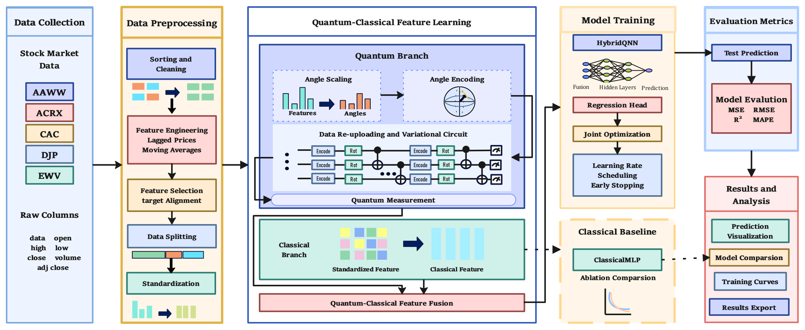
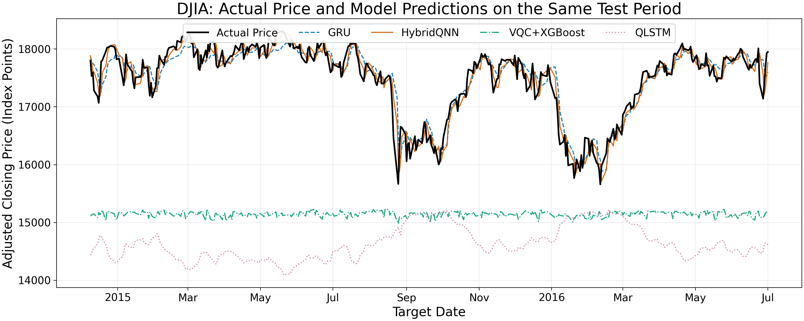

<div align="center">

# ⚛️ HybridQNN

**Data-Reuploading Quantum Features for Adjusted Closing-Price Regression**

A data re-uploading variational quantum circuit fused with a classical MLP head,
trained to predict the **next trading day's adjusted close** from price/volume features —
optionally enriched with market sentiment distilled from Reddit news headlines.


[Highlights](#-highlights) •
[Installation](#-installation) •
[Data sources](#-data-sources) •
[Pipeline](#-pipeline) •
[Architecture](#-model-architecture) •
[Citation](#-citation)

</div>

---

The quantum module is a **data re-uploading variational circuit**, built with PennyLane, whose expectation values are concatenated with the standardized classical features and fed into a compact MLP head. Both models below are trained on **identical splits** so the comparison stays fair:

| Model | Description |
| --- | --- |
| **HybridQNN** | Quantum circuit with variational parameters trained jointly with the MLP head |
| **ClassicalMLP** | Pure classical MLP with a matched parameter count |

---

## ✨ Highlights

| Feature | Detail |
| --- | --- |
| **Data re-uploading circuit** | 4 layers of `AngleEmbedding → Rot(α,β,γ) → circular CNOT`, so features are injected at every layer, not just once |
| **Rich readout** | ⟨Zᵢ⟩ per qubit **plus** nearest-neighbour ⟨ZᵢZᵢ₊₁⟩ correlations, giving a `2n−1`-dimensional quantum feature vector |
| **Leakage-conscious preprocessing** | Chronological split (no shuffling), scalers fitted on training data only, technical indicators lagged by one day |
| **Sentiment pipeline** | RedditNews headlines → DistilBERT (`sentiment_model/`) → per-day positive probability (`pos_mean`) |
| **Statistical validation** | Multi-seed runs (42–45) with paired *t*-tests between hybrid and classical models |
| **Reproducibility** | Every run dumps metrics, scaler, weights, training curves and a timestamped log file |

> [!NOTE]
> All quantum results come from **classical state-vector simulation**, not from real quantum hardware.

---

## 🗂️ Repository layout

<details>
<summary><b>Expand file tree</b></summary>

```
HybridQNN/
├── Dataset/
│   ├── DJIA/                           # ← Kaggle "Daily News for Stock Market Prediction"
│   │   ├── RedditNews.csv              # raw daily news headlines (input to sentiment model)
│   │   ├── Combined_News_DJIA.csv      # alternative raw news source
│   │   └── upload_DJIA_table.csv       # raw DJIA OHLCV + adj close table
│   ├── AAWW.csv  ACRX.csv  CAC.csv  DJP.csv  EWV.csv   # ← FNSPID full_history.zip (Hugging Face)
├── sentiment_model/                    # ⚠️ not tracked by Git — auto-created on first run (see Installation)
├── docs/
│   └── figures/
│       ├── framework_Figure1.png       # framework overview (Figure 1)
│       └── stock_model_comparison.png  # model comparison on DJIA (Figure 2)
├── utils.py                            # features, splitting, scaling, metrics, plotting
├── use_sentiment_model.py              # step 1: news          → sentiment scores
├── integrate_data.py                   # step 2: sentiment     → processed_data.csv
├── feature_plots.py                    # step 3: EDA (scatter + correlation heatmap)
├── train_stock_sentiment.py            # step 4: DJIA experiment (with sentiment)
├── train_single_stock.py               # step 4b: single-asset experiment (price only)
├── plot_paired_mse_reductions.py       # step 5: paired MSE-reduction figure
└── compare_stock_models.py             # step 6: cross-architecture comparison
```

</details>

---

## ⚙️ Installation

```bash
git clone https://github.com/lishanshen/HybridQNN.git
cd HybridQNN

python -m venv .venv
source .venv/bin/activate          # Windows: .venv\Scripts\activate
pip install -r requirements.txt
```

> [!IMPORTANT]
> **`sentiment_model/` is not tracked by Git at all.** Its weights (`model.safetensors`) are ~255 MB and exceed GitHub's 100 MB file limit, so the whole directory is git-ignored. Nothing to do by hand — on the first run `use_sentiment_model.py` falls back to `distilbert-base-uncased-finetuned-sst-2-english` on the Hugging Face Hub and materialises the directory automatically. To create it explicitly, run:
>
> ```bash
> python -c "from transformers import AutoTokenizer, DistilBertForSequenceClassification as M; \
> m = M.from_pretrained('distilbert-base-uncased-finetuned-sst-2-english'); \
> m.save_pretrained('sentiment_model'); \
> AutoTokenizer.from_pretrained('distilbert-base-uncased-finetuned-sst-2-english').save_pretrained('sentiment_model')"
> ```

> [!TIP]
> A GPU is optional. PennyLane selects `lightning.gpu` when CUDA is available and falls back to `lightning.qubit` otherwise; the classical head follows the same CUDA/CPU device.

---

## 📦 Data sources

Both datasets are public and must be downloaded separately — they are **not** redistributed in this repository.

### 1 · News + DJIA prices — sentiment experiments

**Daily News for Stock Market Prediction** by Aaron Sun (Kaggle): <https://www.kaggle.com/datasets/aaron7sun/stocknews>

| File | Role |
| --- | --- |
| `RedditNews.csv` | Daily Reddit world-news headlines, 2008-08-08 → 2016-07-01 — input to the sentiment model |
| `Combined_News_DJIA.csv` | Alternative combined-news view of the same period |
| `upload_DJIA_table.csv` | DJIA OHLCV + adjusted close for the same trading days |

Place all three in `Dataset/DJIA/`. After step 2 the modelling table holds **1,989 trading days (2008-08-08 → 2016-07-01)**.

### 2 · Five-asset price history — single-asset experiments

**FNSPID** (Financial News and Stock Price Integration Dataset) by Zihan Dong, Xinyu Fan and Zhiyuan Peng (KDD 2024), hosted on Hugging Face: <https://huggingface.co/datasets/Zihan1004/FNSPID>

```bash
wget https://huggingface.co/datasets/Zihan1004/FNSPID/resolve/main/Stock_price/full_history.zip
unzip full_history.zip        # one CSV per ticker: Date, Open, High, Low, Close, Adj Close, Volume
```

| Ticker | Rows | Coverage |
| --- | ---: | --- |
| AAWW | 3,686 | 2005-11-09 → 2020-07-02 |
| ACRX | 3,241 | 2011-02-11 → 2023-12-28 |
| CAC | 6,599 | 1997-10-08 → 2023-12-28 |
| DJP | 4,320 | 2006-10-30 → 2023-12-28 |
| EWV | 3,112 | 2007-11-08 → 2020-06-19 |

Copy each `<TICKER>.csv` into `Dataset/`. The raw exports use lowercase column names and descending date order; `load_stock_data()` in `train_single_stock.py` standardizes the headers and re-sorts chronologically, so no manual cleanup is needed.

> [!WARNING]
> **License:** the *code* here is MIT, but the *datasets* keep their own terms. FNSPID is released under [CC BY-NC 4.0](https://creativecommons.org/licenses/by-nc/4.0/) (non-commercial use only); the Kaggle news dataset is governed by the terms on its dataset page. Cite both sources when building on this work — see [Citation](#-citation).


### 3 · Sentiment model resource

The sentiment features are produced by **`distilbert-base-uncased-finetuned-sst-2-english`** — a two-label (NEGATIVE / POSITIVE) DistilBERT classifier. **The weights are not shipped with this repository: download them yourself** (≈ 256 MB) and place the files in `sentiment_model/`.

| Source | Link |
| --- | --- |
| Official — Hugging Face | <https://huggingface.co/distilbert-base-uncased-finetuned-sst-2-english> |

```bash
# Option A — official Hugging Face endpoint
huggingface-cli download distilbert-base-uncased-finetuned-sst-2-english --local-dir sentiment_model

# Option B — clone the repository directly
git clone https://hf-mirror.com/distilbert-base-uncased-finetuned-sst-2-english sentiment_model
```

Expected contents of `sentiment_model/`: `config.json`, `model.safetensors`, `tokenizer.json`, `tokenizer_config.json`.

> [!IMPORTANT]
> Downloading is **required** — the news-scoring step below has no way to produce sentiment features without this checkpoint. Placing the files manually is recommended; if `sentiment_model/` holds no weights, `use_sentiment_model.py` falls back to fetching the checkpoint from the Hugging Face Hub at run time, which you can point at the mirror with `HF_ENDPOINT=https://hf-mirror.com python use_sentiment_model.py`.

---

## 🧠 Model architecture



*Figure 1 — Overall framework. Five FNSPID assets are preprocessed into lagged, standardized features; a data re-uploading quantum branch (angle scaling → angle encoding → variational circuit → measurement) and a classical branch learn representations in parallel and are fused before the regression head. Training uses joint optimization with LR scheduling and early stopping, and the ClassicalMLP ablation is evaluated under identical splits.*

| Stage | Setting |
| --- | --- |
| **Encoding** | Angle embedding, X rotation, inputs scaled to [−π, π] |
| **Variational block** | `Rot(α,β,γ)` per qubit + circular CNOT entanglement, repeated over layers |
| **Measurement** | ⟨Zᵢ⟩ (n) + ⟨ZᵢZᵢ₊₁⟩ (n−1) |
| **Qubits** | One per input feature (9 price features, or 10 with sentiment) |
| **Variational layers** | 4 |
| **Entanglement** | Circular (ring) |
| **Backend** | `lightning.qubit` (or `lightning.gpu` on CUDA), `diff_method="adjoint"` |
| **Head** | 64 → 32 → 1, ReLU + Dropout(0.2) |
| **Optimizer** | Adam, lr 0.01, weight decay 1e-5 |
| **Batch / epochs** | 64 / up to 200, early stopping patience 25 |
| **Scheduler** | `ReduceLROnPlateau` (factor 0.5, patience 10) |

> [!IMPORTANT]
> Quantum expectation values are evaluated on CPU, so the quantum parameters stay on CPU while the MLP head moves to the GPU.

---

## 📊 Data splits

| Script | Split |
| --- | --- |
| `train_stock_sentiment.py` | 60 % train / 20 % validation / 20 % test (chronological) |
| `train_single_stock.py` | 80 % train → of which the last 15 % is validation; 20 % test |

Both use `prepare_features()`, which shifts the target forward by one row so that **today's features predict tomorrow's `Adj Close`**.

## 🔄 Pipeline

Six numbered steps, from raw headlines to paired statistical comparison.

| Script | Flow |
| --- | --- |
| *(manual)* | Hugging Face DistilBERT checkpoint → `sentiment_model/` |
| `use_sentiment_model.py` | `RedditNews.csv` → `processed_data.csv` + `sentiment_features.csv` |
| `integrate_data.py` | `sentiment_features.csv` → final modelling table |
| `feature_plots.py` *(optional)* | modelling table → EDA plots in `results/figures/` |
| `train_stock_sentiment.py` · `train_single_stock.py` | modelling table → metrics, curves, checkpoints |
| `plot_paired_mse_reductions.py` | `metrics.json` files → paired MSE-reduction figure |
| `compare_stock_models.py` *(optional)* | saved checkpoints → cross-architecture comparison |

<details>
<summary><b>Step 0 — Prepare the sentiment model</b></summary>

`sentiment_model/` holds a local two-label (NEGATIVE / POSITIVE) DistilBERT checkpoint. Drop any compatible Hugging Face checkpoint into that folder (`config.json`, `model.safetensors`, `tokenizer.json`, `tokenizer_config.json`) — the recommended `distilbert-base-uncased-finetuned-sst-2-english` checkpoint and its download links are listed under [Sentiment model resource](#3--sentiment-model-resource).

</details>

<details>
<summary><b>Step 1 — Score news sentiment</b></summary>

```bash
python use_sentiment_model.py
```

Runs batched inference over every headline in `Dataset/DJIA/RedditNews.csv` and writes:

- `Dataset/DJIA/processed_data.csv` — one row per headline with its positive probability
- `Dataset/DJIA/sentiment_features.csv` — one row per date, with up to 50 per-headline scores (`pos_1 … pos_50`)

</details>

<details>
<summary><b>Step 2 — Merge sentiment with prices</b></summary>

```bash
python integrate_data.py
```

Reads `sentiment_features.csv`, drops non-trading days, aggregates `pos_mean`, and derives `prev_adj_Close`, `ma_5`, `ma_20`, `open_today`. Overwrites `Dataset/DJIA/processed_data.csv` with the final modelling table.

> The single-asset CSVs (`AAWW`, `ACRX`, `CAC`, `DJP`, `EWV`) are used directly by `train_single_stock.py`, which computes the same derived columns internally.

</details>

<details>
<summary><b>Step 3 — Exploratory plots (optional)</b></summary>

```bash
python feature_plots.py
```

Writes `results/figures/key_features_vs_target.png` and `results/figures/correlation_features_targets.png`.

</details>

<details>
<summary><b>Step 4 — Train and evaluate</b></summary>

**DJIA with sentiment (10 features → 10 qubits):**

```bash
python train_stock_sentiment.py                 # single run, seed 42
python train_stock_sentiment.py --n_runs 5      # multi-seed + paired t-tests
python train_stock_sentiment.py --skip_baselines
```

**Single asset, price-only (9 features → 9 qubits):**

```bash
python train_single_stock.py --stock AAWW --seed 42
python train_single_stock.py --stock ACRX --skip_baselines
```

Both commands train the hybrid model *and* the classical baselines on the same splits, then report MSE / R² / RMSE / MAPE.

</details>

<details>
<summary><b>Step 5 — Paired MSE-reduction figure</b></summary>

```bash
python plot_paired_mse_reductions.py            # add --show to display interactively
```

Aggregates `results/single_stock/<ASSET>/seed_*/metrics.json` over assets `AAWW, ACRX, CAC, DJP, EWV` and seeds `42–45`, writing PNG/PDF/SVG plus `results.json` to `output/paired_mse_reductions/`.

</details>

<details>
<summary><b>Step 6 — Cross-architecture comparison (optional)</b></summary>

```bash
python compare_stock_models.py --points 100 --start-date 2015-01-01
```

Re-loads saved checkpoints and evaluates **GRU**, **HybridQNN**, **VQC+XGBoost** and **QLSTM** on the intersection of their test periods. No model is retrained. The default checkpoint paths point to sibling research directories; override them with `--gru-model`, `--hybrid-model`, `--vqc-model`, `--qlstm-model`, … as needed. Output goes to `output/model_comparison/`.

</details>

---


---

## 📈 Results



*Figure 2 — DJIA next-day adjusted close on the 394 shared test dates (2014-12-09 → 2016-07-01). HybridQNN tracks the actual curve most closely, with RMSE 181.40 versus 221.85 for GRU, 2,412.60 for VQC+XGBoost and 2,973.90 for QLSTM. This is a checkpoint comparison — see [Notes and limitations](#-notes-and-limitations).*

---

## 🗃️ Outputs

```
results/single_stock/<ASSET>/seed_<N>/
├── model.pth               # best checkpoint (early-stopped on validation loss)
├── feature_scaler.pkl      # fitted StandardScaler
├── y_mean_std.npy          # target mean/std for denormalization
├── metrics.json            # hybrid + classical metrics
├── prediction_plot.png     # true vs predicted
├── training_curve.png      # train/validation loss
├── comparison_plot.png     # hybrid vs classical
└── train_log_<timestamp>.txt
```

Multi-seed runs additionally write `results/optimized/summary.json` with per-model mean ± std and the paired *t*-test statistics.

---

## 🧩 Requirements

| Category | Packages |
| --- | --- |
| Core runtime | Python ≥ 3.10 |
| Deep learning | PyTorch ≥ 2.0 |
| Quantum simulation | PennyLane ≥ 0.35 (`lightning.qubit`; `lightning.gpu` optional for CUDA) |
| Sentiment model | transformers + safetensors (DistilBERT checkpoint) |
| Data & plotting | scikit-learn, scipy, pandas, numpy, matplotlib, seaborn, joblib |

Pinned versions live in [`requirements.txt`](requirements.txt).

---

## ⚠️ Notes and limitations

- `Dataset/DJIA/sentiment_features.csv` is generated by step 1 and is not tracked in git.
- `compare_stock_models.py` reproduces historical checkpoints rather than retraining; the GRU entry inherits the original run's full-data scaling, so treat it as a checkpoint comparison, not a clean hold-out benchmark.
- News-based sentiment covers the DJIA dataset only; single-asset runs use price/volume features alone.
- All quantum results come from classical simulation.

---

## 📜 Citation

If you use this code, please cite it — and the two datasets it builds on:

```bibtex
@misc{hybridqnn2026,
  title  = {HybridQNN: Hybrid Quantum-Classical Neural Networks for Stock Forecasting},
  author = {<LinHong>},
  year   = {2026},
  url    = {https://github.com/lishanshen/HybridQNN}
}

% Data source 1 — five-asset price history
@misc{dong2024fnspid,
  title        = {FNSPID: A Comprehensive Financial News Dataset in Time Series},
  author       = {Dong, Zihan and Fan, Xinyu and Peng, Zhiyuan},
  year         = {2024},
  eprint       = {2402.06698},
  archivePrefix= {arXiv},
  primaryClass = {q-fin.ST}
}

% Data source 2 — DJIA news + prices
@misc{aaron7sun_stocknews,
  title  = {Daily News for Stock Market Prediction},
  author = {Sun, Aaron},
  year   = {2016},
  howpublished = {Kaggle},
  url    = {https://www.kaggle.com/datasets/aaron7sun/stocknews}
}
```

---

## 🙏 Acknowledgements

- [FNSPID](https://huggingface.co/datasets/Zihan1004/FNSPID) (Dong, Fan & Peng, KDD 2024) for the per-ticker price archives used in the five-asset experiments.
- [Daily News for Stock Market Prediction](https://www.kaggle.com/datasets/aaron7sun/stocknews) (Aaron Sun) for the DJIA news headlines and index prices.
- [PennyLane](https://pennylane.ai/) and [PyTorch](https://pytorch.org/) for the quantum simulation and training stack.

---

<div align="center">

**📄 License**

MIT — see [`LICENSE`](LICENSE).

</div>
